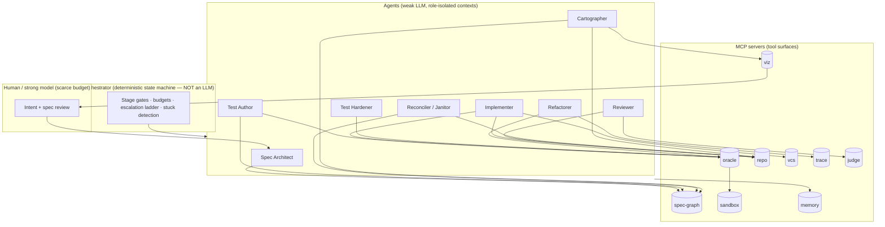

# Weak-Model SDLC Machinery: Agents, MCPs, Skills, and the Spec Graph

## 1. Reframing "the spec"

The reason "what is the spec" feels unanswerable is that a spec is usually treated as a *document* — a static artifact that decays the moment code diverges from it. Tests don't fix this: tests are the *leaves* of the spec, and looking at leaves tells you nothing about the wiring.

The move that fixes this: **the spec is a typed, queryable graph** that the whole system reads and writes. Call it the **Spec Graph**. It is the source of truth that everything else hangs off of, and it is what you render when you want to "see the wiring."

### Node types

| Node | Meaning | Example |
|---|---|---|
| `Intent` | Human-level goal, prose allowed here and only here | "Users can reset passwords via email" |
| `Criterion` | One checkable acceptance criterion | "Reset link expires after 30 min" |
| `Contract` | Interface: signature, types, pre/postconditions | `reset_token(user) -> Token`, post: `token.ttl == 1800` |
| `Invariant` | Cross-cutting rule, always true | "No plaintext tokens in logs" |
| `Test` | Concrete test/property/fuzz target | `test_token_expiry` |
| `Symbol` | Code unit: function, class, module | `auth/tokens.py::issue_reset` |
| `Decision` | Recorded tradeoff/constraint (mini-ADR) | "Chose HMAC over JWT because…" |

### Edge types

| Edge | From → To | Question it answers |
|---|---|---|
| `refines` | Intent → Criterion | What does "done" mean concretely? |
| `binds` | Criterion → Contract | What interface satisfies this? |
| `verifies` | Test → Criterion / Contract / Invariant | What checks this? |
| `implements` | Symbol → Contract | What code fulfills this? |
| `depends_on` | Symbol → Symbol | Runtime/import wiring |
| `constrains` | Decision → anything | Why is it this way? |

### The payoff: drift becomes a query, not an archaeology dig

Every "mess" a weak model leaves behind is a **graph defect** with a name:

| Defect | Graph query | What it means in practice |
|---|---|---|
| **Orphan code** | Symbol with no `implements` edge | Half-finished stuff the model abandoned |
| **Uncovered criterion** | Criterion with no incoming `verifies` | Spec point nobody tests |
| **Dead spec** | Contract with no `implements` | Planned but never built |
| **Untraced test** | Test with no `verifies` edge | Test that guards nothing anyone asked for |
| **Stale node** | Symbol hash changed since edge created | Code drifted after linkage |
| **Dangling dep** | `depends_on` into a deleted Symbol | Broken wiring from partial edits |

"Clean up the mess" stops being a vague reasoning task (which weak models fail at) and becomes: *enumerate defects, dispatch each to a playbook*. That is exactly the kind of mechanical loop a weak model can run.

---

## 2. System diagram

Two structural rules the diagram encodes:

1. **The orchestrator is code, not a model.** Weak models don't follow instructions; they follow rails. Stage transitions, budgets, and escalation live in deterministic logic.
2. **Agents never talk to each other directly.** All coordination flows through the Spec Graph and the orchestrator. This kills context contamination (a reviewer who has read the implementer's rationalizations agrees with them) and makes every handoff auditable.

---

## 3. MCP servers

| MCP | Core tools | Role | Integrity rules |
|---|---|---|---|
| **spec-graph** | `add_node`, `link`, `query`, `drift_report`, `lock_node`, `diff_since(checkpoint)` | The source of truth. Stores the graph above; answers wiring and drift queries. | Criteria/Tests lock at stage gates; only orchestrator or human can unlock. Every mutation is journaled. |
| **oracle** | `run(artifact, suite) -> Verdict` where Verdict = `{pass, score, structured_diagnostics}` | Uniform verification facade over: typecheck, lint, unit/integration tests, mutation runs, property/fuzz, differential testing, perf budgets. | One interface for everything so the orchestrator composes oracles freely. Includes the **feedback compiler**: diagnostics are localized (<~300 tokens of relevant material, file:line, minimal repro window). |
| **repo** | `symbol_index`, `search`, `dep_graph`, `read_window`, `fact_sheet(scope)` | Curated context assembly. `fact_sheet` distills conventions + relevant interfaces into a small pinned block. | Agents never get "the whole repo." Median assembled context per call is a tracked metric. |
| **vcs** | `checkpoint`, `rollback`, `worktree`, `diff` | Every green state is a checkpoint. Rollback is the default recovery, not debugging. | Implementer can commit to its worktree only; merges gated by orchestrator. |
| **sandbox** | `snapshot`, `restore`, `exec`, `affected_tests(diff)` | Hermetic, fast inner loop. Test selection keeps iterations in seconds. | Pinned seeds/clocks; flaky tests auto-quarantined and filed as toolkit P0s. |
| **trace** | `coverage(diff)`, `exec_trace`, `behavior_diff(old, new, inputs)` | Runtime evidence: what actually ran, and did behavior change. Powers refactoring's equivalence oracle. | Traces are append-only artifacts linked into the graph. |
| **memory** | `log_attempt`, `failures(task)`, `decisions(scope)` | Failure memory injected into retries so the model doesn't loop; decision log feeds `Decision` nodes. | Write-once; retries must cite prior failure IDs they're addressing. |
| **judge** | `score(artifact, rubric) -> per_criterion_verdicts` | LLM judging for what machines can't check (naming, readability, architectural fit). | Checklist rubrics with binary per-item verdicts, k-sample voting, judge context isolated from generator context. |
| **viz** | `render(view, scope) -> svg/html` | Renders graph views (below). The answer to "show me the wiring." | Read-only over spec-graph + trace + oracle history. |

### The four views `viz` must support

1. **Wiring view** — Intent → Criteria → Contracts → Symbols, with `depends_on` edges overlaid. "How does it all link up."
2. **Coverage/health overlay** — same graph, colored: green (verified, fresh), yellow (stale edge), red (defect from the drift table). One glance shows where the weak model left a mess.
3. **Drift diff** — graph state at checkpoint A vs. now: nodes/edges added, orphaned, broken. This is your code-review artifact for agent work — review the *graph delta*, not just the code diff.
4. **Blast radius** — given a proposed change to a Symbol or Contract, transitive closure of affected criteria and tests. Feeds test selection and tells the implementer how scared to be.

---

## 4. Agents

Each agent = weak model + fixed system prompt + restricted MCP toolset + isolated context. Restriction is the point: capability comes from the rails, not the model.

| Agent | Consumes | Produces | Success oracle | MCP access |
|---|---|---|---|---|
| **Spec Architect** | Intent prose, fact sheets | Criterion, Contract, Invariant, Decision nodes | Human/strong-model sign-off (the one place to spend expensive judgment); completeness lints (every Intent has ≥1 Criterion; every Criterion is mechanically checkable) | spec-graph, repo (read) |
| **Test Author** | Locked Criteria + Contracts (never the implementation) | Tests + `verifies` edges | Tests fail before implementation exists (red-first check); type-clean; deterministic over 10 runs | spec-graph, oracle, sandbox |
| **Implementer** | Locked Contracts, failing tests, fact sheet, failure memory | Symbols + `implements` edges | Oracle stack green: types, lint, tests, no invariant violations | repo, oracle, vcs (own worktree), memory |
| **Reviewer** | Diff + graph delta only — no implementer context | Per-checklist verdicts, blocking findings | Checklist items are individually binary; findings must cite file:line or graph defect | repo (read), judge, spec-graph (read) |
| **Test Hardener** | Green suite + mutation report | Strengthened tests | Mutation kill rate ≥ threshold; no flakiness introduced | oracle, spec-graph |
| **Refactorer** | Symbol scope + behavior corpus | Behavior-preserving diff | `behavior_diff` empty on recorded corpus + full suite green + complexity/perf budgets | repo, oracle, trace, vcs |
| **Reconciler (Janitor)** | `drift_report` output | Per-defect fixes: link, delete, ticket, or quarantine | Drift report shrinks; nothing green goes red | spec-graph, repo, vcs |
| **Cartographer** | Repo + graph, on every merge | Refreshed indexes, dep edges, stale-marks, rendered views | Graph hash-consistent with repo HEAD | repo, spec-graph, viz |

Notes:

- **Reconciler is your answer to "weaker LLMs leave partial stuff."** It never reasons about *why* the mess exists; it pattern-matches defects to playbooks. Orphan symbol → propose delete or propose spec node, human tie-breaks in batch. Untraced test → propose `verifies` edge or flag for deletion.
- **Cartographer is your answer to "visualize the wiring."** It's the only agent whose job is keeping the map true. Everything downstream (blast radius, drift, review) depends on it, so it runs on every merge, not on demand.
- There is deliberately **no autonomous "Planner" agent.** Planning-as-freeform-LLM-output is where weak models hurt you most. Decomposition happens inside playbooks with fixed shapes, arbitrated by the deterministic orchestrator.

---

## 5. Skills (playbooks)

Skills are versioned procedure documents the orchestrator loads per task type. They encode *shape*, so the model supplies only local decisions.

| Skill | Fixed procedure (abridged) | Hard gates |
|---|---|---|
| **feature** | Spec Architect → human spec gate → Test Author (tests locked) → Implementer sample-N/repair loop → Test Hardener → Reviewer → merge | No implementation before locked red tests; no merge below mutation threshold |
| **bugfix** | Write failing reproduction test FIRST → link `verifies` to violated Criterion (create it if the bug reveals a spec gap) → fix → confirm flip → blast-radius regression run | No code edits until repro test exists and fails |
| **refactor** | Record behavior corpus via trace → transform → `behavior_diff` must be empty → suite green | Any behavioral delta = automatic rollback, no repair attempts |
| **test-harden** | Mutation run → per-surviving-mutant kill loop → flakiness check (10×) | Kill-rate floor; zero new flakes |
| **reconcile** | `drift_report` → per-defect dispatch table → batched human tie-breaks | May delete only orphans below a size threshold; larger orphans become tickets |
| **review** | Graph delta first, then diff, then checklist walk | Every finding cites evidence; "looks fine" is not a permitted verdict |
| **spec-elicitation** | Question ladder for the human: examples → counterexamples → boundaries → invariants; each answer becomes a graph node immediately | Session output must be graph nodes, never prose notes |

---

## 6. Lifecycle walkthrough (feature)

1. Human states intent. **Spec Architect** decomposes into Criteria/Contracts/Invariants; **spec-elicitation** skill drives clarifying questions. Human reviews the *rendered wiring view* — a graph with 6 criteria is reviewable in a minute; a prose spec is not. Gate: sign-off, nodes lock.
2. **Test Author** writes tests from locked nodes only. Oracle confirms all red. Tests lock.
3. Orchestrator spawns k **Implementer** candidates in parallel worktrees. Each runs a tight repair loop on compiled, localized feedback. Selection keeps the best-scoring candidate; crossbreeding is allowed (cherry-pick passing symbols across candidates).
4. **Test Hardener** mutates; surviving mutants become kill-loop targets.
5. **Reviewer** sees graph delta + diff, walks checklist. Blocking findings return to step 3 with findings in failure memory.
6. Merge. **Cartographer** refreshes the map. **Reconciler** runs the drift report; defects introduced by this merge are fixed while context is hot.
7. Stuck at any stage (oscillation, repeated-error, budget burn) → escalation ladder: resample → re-decompose → strong model → human, each rung with its own budget.

---

## 7. Integrity invariants (non-negotiable)

1. Tests, lint configs, CI definitions, and locked graph nodes are **read-only to the Implementer**. Physically, not by convention.
2. A held-out slice of acceptance tests is never shown to any generating agent — evaluated only at the merge gate.
3. Degenerate-solution detectors run on every candidate: hardcoded test inputs, deleted assertions, broadened exception swallowing, `type: ignore` density.
4. Every artifact the system produces must land in the graph or it doesn't exist. Untracked output is the defect class you're eliminating; don't let the toolkit itself produce it.
5. Primary system metric: **cost per verified graph edge** (criterion verified, contract implemented, defect cleared) — not tokens, not tasks "completed."