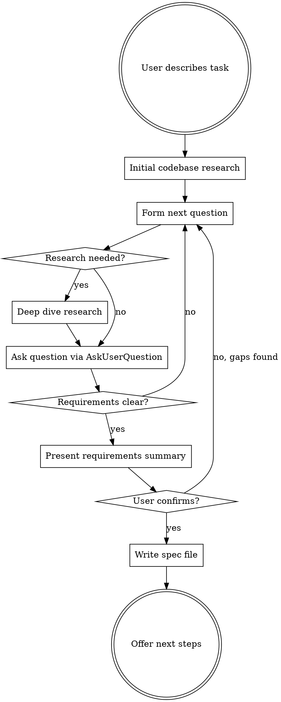

# Interview

## Overview

Thoroughly investigate what is actually intended before touching code. Research the codebase and external sources, then interrogate the user until every detail is unambiguous. Produce a self-contained requirements spec with a Definition of Done checklist — each step backed by testable, LLM-invokable proofs. The resulting spec can be passed directly to `/goal` for autonomous implementation.

**Core principle:** Never assume. If you don't know, research it. If you can't research it, ask.

**Announce at start:** "I'm using the interview skill to understand the full requirements before we build anything."

## The Iron Rule

**Do NOT write code, create plans, or start implementation until the user has explicitly confirmed the requirements summary is complete and accurate.**

This is non-negotiable. Not for "simple" tasks. Not for "obvious" features. Not when you're "pretty sure" you understand.

## Process Flow



## Phase 1: Initial Research

Before asking the user anything, gather context autonomously:

1. **Scan relevant code** — Use Explore agent or Grep/Glob to find files, patterns, and architecture related to the task
2. **Check existing tests** — Understand what's already tested and how
3. **Look for prior art** — Has something similar been built in this codebase?
4. **Check docs/plans/** — Are there existing specs or plans related to this?

**Goal:** Form informed questions. Don't ask the user things you can find in the code.

## Phase 2: Structured Questioning

Ask questions **one at a time** via AskUserQuestion. Each question should be:

- **Specific** — not "what do you want?" but "should the retry logic use exponential backoff or fixed intervals?"
- **Informed** — reference what you found in research: "I see the existing auth uses JWT tokens. Should the new endpoint follow the same pattern?"
- **Unambiguous** — no jargon without definition, no pronouns with unclear antecedents
- **Multiple choice when possible** — with your recommendation marked

### Question Categories

Work through these as relevant (not all apply to every task):

- **Purpose** — What problem does this solve? Who is it for?
- **Inputs/Outputs** — What data goes in? What comes out? What format?
- **Behavior** — What should happen in the happy path? What about errors?
- **Edge cases** — Empty inputs? Concurrent access? Rate limits? Timeouts?
- **Constraints** — Performance requirements? Compatibility? Security?
- **Integration** — How does this connect to existing code? What contracts must it honor?
- **Scope boundaries** — What is explicitly NOT included?

### Minimum Questions by Scope

Scale clarifying questions to the change's blast radius. PBI #31790 — a 17-file, 6-project
change — shipped after only **3** questions, leaving real ambiguities unprobed (`Copy()`
semantics for the new property, separate-flag vs shared-logic, rollback on validation failure).
Use the floor below as a **minimum**, derived from the scope you established in Phase 1 research:

| Estimated scope (from Phase 1) | Minimum clarifying questions |
|--------------------------------|------------------------------|
| Trivial — 1 file, single function | 1–2 |
| Small — 1–3 files, one component/layer | 2–3 |
| Medium — 4–8 files, or 2+ layers | 4–5 |
| Large — 9+ files, or 3+ projects/layers | 6+ |

Rules:
- The floor is a **minimum, not a target**. Hitting it does not mean you are done — if competing
  interpretations, undefined error behavior, or unprobed cross-cutting concerns remain, keep asking.
- Count **distinct decision-driving questions**, not the option choices inside a single question.
- Ambiguity scales with cross-layer reach. A change crossing DB → logic → events → UI introduces a
  contract question at **each seam** (clone/copy semantics, shared vs separate logic, failure/rollback
  paths) — probe the seams explicitly for medium/large scope.

### On-Demand Research

When a question reveals you need more context:

- **Codebase:** Dispatch an Explore agent to investigate specific patterns, dependencies, or implementations
- **External:** Use WebSearch/WebFetch to research algorithms, library APIs, standards, or best practices
- **Share findings:** Tell the user what you learned before asking follow-up questions

### Red Flags — You're Not Done Yet

Stop and ask more questions if:

- You're about to write "TBD" or "to be determined" in the spec
- You have competing interpretations of a requirement
- You don't know what the error behavior should be
- You're unsure about the scope boundary
- You've asked fewer questions than the scope floor (see Minimum Questions by Scope), or haven't probed each layer seam of a multi-layer change
- You haven't discussed how to verify correctness

## Phase 3: Requirements Summary

When you believe you understand everything, present a structured summary:

```markdown
## Requirements Summary

**Goal:** [One sentence]

**What it does:**
- [Concrete behavior 1]
- [Concrete behavior 2]

**What it does NOT do:**
- [Explicit exclusion 1]

**Inputs:** [Specific formats, sources]
**Outputs:** [Specific formats, destinations]

**Error handling:**
- [Scenario] -> [Expected behavior]

**Constraints:**
- [Performance/security/compatibility requirements]

**Is this complete and accurate?**
```

The user MUST explicitly confirm before you proceed. If they identify gaps, return to Phase 2.

## Phase 3.4: Hierarchical Decomposition — Build a Task Tree

**Replace flat step lists with a recursive task tree.** The old `steps → proofs[]` pattern produced shallow DoDs with weak proofs. The new `roots → TaskNode[]` pattern enforces functional decomposition: each leaf must be one atomic, independently verifiable behavior.

### TaskNode Structure

A `TaskNode` is EITHER:
- **Task group** — has `children: TaskNode[]`, represents a sub-goal. Decompose until children are pure leaves.
- **Draft leaf** — `refinement: "draft"`, has `intent` (human-readable description of what it will prove). No command yet.
- **Concrete leaf** — `refinement: "concrete"`, has `command`, `predicate`, `description`, `category`. Ready to verify.

### When to Use Draft vs Concrete

- **Concrete when known upfront** — lint, format, full test suite, integration wiring. These are known at planning time. Write exact commands.
- **Draft when implementation-dependent** — behavioral tests, TDD proofs, curl endpoints. You can't write the curl test for an endpoint that doesn't exist yet. Write a clear `intent` describing what behavior will be proven.

Expect ~40-60% concrete (known upfront) and ~40-60% draft (discovered during implementation).

### Decomposition Rules

1. **Decompose until pure** — each leaf must be one atomic, independently verifiable behavior. If "Password hashing" has 3 things to prove, make it a task group with 3 leaf children.
2. **3 levels max** — roots → 2-4 task groups per root → leaves. Deeper = over-decomposed.
3. **Draft groups are fine** — a task group where all children are drafts means "I know what I need to verify here, but the exact commands depend on implementation."
4. **Code quality is always a root** — lint, format, test suite live in their own root task group, separate from feature-specific work.

### Example Tree Structure

For a user auth feature:

```
roots:
  "Code Quality" (task group)
    - "Lint" (concrete): npm run lint → exit_code:0, category: lint
    - "Full test suite" (concrete): npm test → exit_code:0, category: test

  "User Authentication" (task group)
    "Password Hashing" (task group)
      - Draft: "hash_password uses bcrypt with cost >= 10"
      - Draft: "verify_password rejects wrong password"
    "Login Endpoint" (task group)
      - Draft: "POST /login valid creds → 200 + JWT in response body"
      - Draft: "POST /login bad creds → 401 with error message"
    "Integration" (task group)
      - Concrete: "grep 'auth' src/routes.ts" → output_contains:"auth" (wiring)
      - Draft: "curl login endpoint returns JWT" (behavioral)

  "Manual Verification" (task group)
    - "Code review" (manual): peer review
    - "Walkthrough" (manual): run app, verify login flow end-to-end
```

### How to Build the Tree

1. Start with 2-3 root task groups (Code Quality, Feature Work, Manual).
2. For Feature Work, decompose into sub-tasks (Password Hashing, Login Endpoint, etc.).
3. For each sub-task, ask: "What exact behaviors must be verified?" Write each as a leaf.
4. Mark leaves as concrete (known command) or draft (intent only).
5. Run the adversarial spec review (Phase 3.6) against the tree — 5 parallel lenses attack the spec from independent angles, finding missing requirements, untestable claims, and hidden assumptions before any code is written.

**Anti-patterns:**
- One concrete proof per task group claiming to cover the entire sub-goal (e.g., "Tests pass" for "User Auth" with no decomposition)
- All leaves concrete with no drafts (means you're guessing at implementation details)
- All leaves drafted with no concrete (means no structural verification)

## Phase 3.5: Apply Company DoD Baselines

Before constructing the DoD steps, determine the work type and apply the company baseline from `standards/dod-baselines.md`.

### Determine Work Type

| If the task is… | Work type | Baseline |
|-----------------|-----------|----------|
| A bug fix, defect, regression, incident | **Bug** | Bug Fix baseline |
| A feature, enhancement, refactor, new component | **General** | General (Algemeen) baseline |

### Assess Project Cleanliness (Phase 1 output)

Before choosing proof commands, check the project's current lint/format state:

1. Run the language-appropriate linter on the full project — count existing violations. Record as `LINT_BASELINE`.
2. Run the formatter in **dry-run/check mode** — count files that would be changed. Record as `FORMAT_BASELINE`.
3. **If mostly clean (<10 violations)**: proactively fix remaining issues and use zero-tolerance greenfield proofs. Small cleanup is worth it.
4. **If dirty (10+ violations)**: use delta proofs:
   - **Lint**: scope to changed files, or assert warning count `<= LINT_BASELINE`
   - **Format**: dry-run only, assert violation count `<= FORMAT_BASELINE`. Never auto-format in brownfield — even single-file formatting can dominate a PR diff and make review impossible.

Record both baselines in `research_notes` so proofs can reference them.

See `standards/language-commands.md` for greenfield vs brownfield commands per language.

### Mandatory Minimum Proofs

**For Bug Fixes, the DoD must include at minimum:**

1. **Lint/quality** — lint proof scoped to changed files (or baseline count comparison if project has existing debt)
2. **Format/standards** — dry-run formatter, assert violation count `<= FORMAT_BASELINE` (never auto-format)
3. **Regression test (TDD)** — a `tdd: 0` proof ensuring a test for this specific bug was written red-first
4. **Regression test structure** — an `output_matches` proof verifying the test has real assertions about the bug condition
5. **Full test suite** — an `exit_code: 0` proof running the complete test suite (no regressions)
6. **Integration** — two-layer integration proof: (1) structural wiring — grep that the fix is connected to the system, (2) behavioral — exercise it through the system's real entry point. See Integration Proof Design below. This is the **last machine-checkable step** — it gates the transition to manual proofs.
7. **Application walkthrough** — a `manual` proof: run the app, verify the fix works and existing features aren't broken
8. **Code review** — a `manual` proof for peer review

**For General work, the DoD must include at minimum:**

1. **Lint/quality** — lint proof scoped to changed files (or baseline count comparison if project has existing debt)
2. **Format/standards** — dry-run formatter, assert violation count `<= FORMAT_BASELINE` (never auto-format)
3. **New unit tests (TDD)** — a `tdd: 0` proof for tests covering new functionality
4. **New test structure** — an `output_matches` proof verifying tests have meaningful assertions
5. **Full test suite** — an `exit_code: 0` proof running the complete test suite
6. **Documentation** — a structural proof (`exit_code: 0` via grep/find) that documentation exists for new components
7. **Integration** — a machine-checkable proof that exercises the feature through its real entry point (see Integration Proof Design below). This is the **last machine-checkable step** — it gates the transition to manual proofs.
8. **Application walkthrough** — a `manual` proof: run the app, verify new functionality works and existing features aren't broken
9. **Code review** — a `manual` proof for peer review

### Enforcement

- Machine-checkable proofs (lint, tests, TDD, structure) **cannot** be replaced with manual proofs
- TDD proofs are **non-negotiable** — bug fixes need regression tests, features need unit tests
- **Mostly clean (<10 violations)**: proactively fix remaining issues, use zero-tolerance proofs — worth the small cleanup
- **Dirty (10+ violations)**: lint scoped to changed files, format dry-run only with baseline comparison. Never auto-format in brownfield.
- **Integration proof is mandatory** — cannot be replaced with manual. Must exercise the feature's real entry point.
- Additional feature-specific proofs are added on top of these baselines
- If a baseline proof genuinely doesn't apply (e.g., no linter configured), note the omission in `open_risks` and discuss with the user

### Integration Proof Design

Integration proofs exist because **unit tests passing does not mean the feature works**. Claude consistently implements pieces correctly but fails to wire them together. The integration proof catches this by verifying the feature is **reachable from and working through the actual system** — not just that it works in isolation.

**The critical distinction:** A component that passes tests in a mock harness but is never imported into the real app is not integrated. An API handler that works in a test but is never registered in the router is not integrated. A CLI subcommand that works standalone but is never added to the parser is not integrated. Integration means the system knows about the new piece and a real user can reach it.

**Two-layer integration proof (both required):**

Every integration proof must verify two things:

1. **Wiring proof (structural)** — The new piece is connected to the system. Grep for the import, registration, route definition, menu entry, or config that makes the piece reachable. This is a `grep`/`find` with `output_matches` or `exit_code: 0`.

2. **Behavioral proof (runtime)** — The feature works when exercised through the system's actual entry point — not the component's own API, but the path a real user would take. This is a command that hits the running system or calls through the top-level interface.

Both layers are needed because:
- Wiring without behavior catches "registered but broken"
- Behavior without wiring catches "works in test harness but unreachable in production"

**Examples by project type:**

| Project type | Wiring proof (structural) | Behavioral proof (runtime) |
|--------------|---------------------------|----------------------------|
| UI (React/Vue/etc.) | `grep -r "NewComponent" src/pages/` or `grep "path.*new-route" src/router.*` — component imported and rendered in a real page/route | `curl -s localhost:3000/new-route` → `output_contains: "expected-element"` or test that renders the full page (not the component in isolation) and asserts the component appears |
| API/server | `grep "router\.\(get\|post\|put\).*new-endpoint" src/routes/` — route registered in the real router | `curl -s localhost:3000/api/new-endpoint` → `output_contains: "expected_field"` |
| CLI tool | `grep "add_subcommand\|command.*new-cmd" src/main.*` — subcommand registered in the parser | `./my-tool new-cmd --help` → `exit_code: 0` + `output_contains: "description"` |
| Library/SDK | `grep "pub use\|export.*NewThing" src/lib.*` — symbol exported from the public API | Test that `use mylib::NewThing` or `import { NewThing } from 'mylib'` compiles/runs → `exit_code: 0` |
| MCP server | `grep "name.*new_tool" src/index.*` — tool listed in the server's tool registration | Call the tool through the MCP protocol or test harness → `output_contains` |
| Plugin/extension | `grep "register\|activate.*NewPlugin" src/plugin-loader.*` — plugin registered in the host system | Test that exercises the host system and observes the plugin's effect → `output_contains` or `exit_code: 0` |
| Refactor | `grep` for the new function/module name at all former call sites — old callers updated | Existing integration/E2E tests still pass → `exit_code: 0` |
| Bug fix | `grep` for the fix at the actual code path (not just a test file) | Reproduce the original bug scenario end-to-end, verify it no longer occurs → `exit_code: 0` |

**Anti-patterns (rejected):**

- ❌ Component tested in React Testing Library / Storybook but never imported in a real page — that's a unit test with a fancy harness, not integration
- ❌ Handler tested directly via function call but never added to the router — works in isolation, unreachable in production
- ❌ Running unit tests and calling it "integration" — unit tests test units, not wiring
- ❌ `grep` for a function definition alone — proves the code exists, not that it's connected to the system
- ❌ A manual proof — integration must be machine-checkable
- ❌ Testing through mock/test infrastructure that bypasses the real system's wiring (mock servers, test harnesses that auto-discover components, in-memory routers)

**Step ordering rule:** The integration proof must be in the **final implementation step** of the DoD (the last step before any manual-only steps). This ensures all pieces are built before integration is verified, and prevents "done" claims when units pass but nothing is wired.

## Phase 3.6: Adversarial Spec Review — Attack the Requirements Before Code Exists

Models are lazy — they accept weak specs to save effort. The adversarial spec review attacks the requirements from multiple independent angles, finding ambiguities, missing edge cases, and contradictions BEFORE any code is written. This replaces the old "contrarian agent" approach (which argued for adding static analysis proofs — those predicates no longer exist).

**When:** After constructing the TaskNode tree in Phase 3.4/3.5 but BEFORE calling `dod_create`.

**Core principle:** Each lens is a clean-context subagent — it sees only the spec + tree structure, never the author's reasoning. Context isolation eliminates confirmation bias (self-critique false positive rate ~30-60%; adversarial review ~7%).

### Five Adversarial Lenses

Dispatch these in parallel. Each lens is a separate subagent with a specific attack surface:

| Lens | Question | Severity if violated |
|------|----------|---------------------|
| **Security** | What STRIDE risks exist? Trust boundaries? Where could bad input cause harm? AuthZ gaps? | critical |
| **Assumptions** | What implicit assumptions does the spec make about the codebase, user behavior, or environment? Are they documented? | major |
| **Testability** | Can each requirement produce a falsifiable behavioral proof? Are any requirements untestable? | major |
| **Consistency** | Do all requirements align with each other? Any contradictions? Scope drift from original ask? | major |
| **Implementability** | Can this be built on the existing architecture? Missing dependencies? Integration seams defined? | minor |

Each lens must find at least 1 issue OR report "NO_FINDINGS: [specific justification of why this lens found nothing]." A bare "no issues found" without justification = invalid verdict (rubber-stamp detection — re-dispatch).

### Verdict Computation

| Verdict | Rule |
|---------|------|
| **GO** | 0 critical, 0-2 major, any minor. All lenses returned valid output. |
| **REVISE** | 1+ critical OR 3+ major. Fix the spec, then re-run adversarial review. |
| **STOP** | 1+ blocker: fundamentally infeasible, security showstopper, or spec contradicts itself irreconcilably. Escalate to user for redesign. |

### Integration Flow

1. **Draft DoD tree** (Phase 3.4/3.5 output)
2. **Dispatch 5 lens subagents in parallel** with the spec summary, tree structure, and project context
3. **Collect findings.** Each lens returns structured output: findings with severity, the lens that found it, and a concrete suggestion
4. **Compute verdict** from aggregated findings
5. **If GO**: present findings summary, proceed to `dod_create`
6. **If REVISE**: present findings to user via AskUserQuestion:
   - Show each finding with severity and suggested fix
   - User resolves each (accept fix, alternative fix, or dismiss with reason)
   - Return to Phase 2 questioning for unresolved critical/major issues
   - Re-run adversarial review after spec is updated
   - Max 3 REVISE iterations — after 3, escalate remaining unresolved findings to user for explicit override
7. **If STOP**: present blocker to user, abort spec creation

### Lens Subagent Prompts

**Security lens:**
```
You are a security reviewer attacking a planned implementation. Review the spec below.
Find: STRIDE threats, injection vectors, authZ gaps, trust boundary violations,
data integrity risks, exposed secrets. Cite specific requirements or tree nodes.
If you find nothing, explain WHY this spec has zero security exposure.

SPEC:
- Goal: {goal}
- Type: {bug|general|minimal}
- Language/stack: {language}
- Requirements: {requirements summary}
- TaskNode tree: {tree structure}

Output EACH finding as:
  SEVERITY: critical|major|minor
  TARGET: which requirement/node this attacks
  PROBLEM: specific vulnerability or gap
  SUGGESTION: how to fix the spec to address this
```

**Assumptions lens:**
```
You are reviewing a spec for hidden assumptions. Review the spec below.
Find: implicit assumptions about the codebase (existing functions, types, patterns),
user behavior (workflows, inputs), environment (OS, dependencies, config),
and data (formats, schemas, constraints). Every undocumented assumption is a bug waiting to happen.
If you find nothing, explain WHY every assumption is already explicit.

SPEC:
- Goal: {goal}
- Type: {bug|general|minimal}
- Language/stack: {language}
- Requirements: {requirements summary}
- TaskNode tree: {tree structure}

Output EACH finding as:
  SEVERITY: critical|major|minor
  ASSUMPTION: what is being assumed
  RISK: what happens if the assumption is wrong
  SUGGESTION: how to validate or document this assumption
```

**Testability lens:**
```
You are reviewing a spec for testability gaps. Review the spec below.
Find: requirements that cannot produce a falsifiable behavioral proof (a command
with clear pass/fail output), draft nodes with vague intents, integration proofs
with undefined entry points, manual proofs that should be machine-checkable.
If you find nothing, explain WHY every requirement maps to a concrete testable proof.

SPEC:
- Goal: {goal}
- Type: {bug|general|minimal}
- Requirements: {requirements summary}
- TaskNode tree: {tree structure}
- Concrete proofs: {list of concrete leaves with commands}
- Draft intents: {list of draft leaves with intents}

Output EACH finding as:
  SEVERITY: critical|major|minor
  UNTESTABLE: which requirement/node lacks a falsifiable proof
  WHY: why it can't be verified by a command
  SUGGESTION: how to rewrite it as a testable behavioral proof
```

**Consistency lens:**
```
You are reviewing a spec for internal contradictions and scope drift. Review
the spec below. Find: requirements that contradict each other, scope that
has drifted from the original goal, edge cases defined one way in one node
and differently in another, tree structure that doesn't match the requirements text.
If you find nothing, explain WHY the spec is internally consistent.

SPEC:
- Goal: {goal}
- Original ask: {user's original request — paste verbatim}
- Requirements: {requirements summary}
- TaskNode tree: {tree structure}

Output EACH finding as:
  SEVERITY: critical|major|minor
  CONFLICT: which two requirements/nodes disagree
  WHY: how they contradict or diverge
  SUGGESTION: how to reconcile them
```

**Implementability lens:**
```
You are reviewing a spec for buildability on the existing codebase. Review
the spec below. Find: missing dependencies, architectural mismatches,
integration seams not defined, patterns that clash with existing code,
scope that requires infrastructure not present in the project.
If you find nothing, explain WHY this fits cleanly into the existing architecture.

SPEC:
- Goal: {goal}
- Language/stack: {language}
- Project structure: {key directories, frameworks, patterns from Phase 1 research}
- Requirements: {requirements summary}
- TaskNode tree: {tree structure}

Output EACH finding as:
  SEVERITY: critical|major|minor
  BLOCKER: what about the architecture makes this hard/impossible
  WHY: why the current approach won't fit
  SUGGESTION: how to adjust the spec or architecture
```

### Post-Review: skip_reasons for Dod Creation

The `skip_reasons` parameter on `dod_create` captures conscious omissions — things deliberately left out of the DoD. After the adversarial review resolves all findings, collect skip_reasons as a flat map:

```json
{
  "why_no_security_tests": "internal tool, no network exposure",
  "why_no_observability_proofs": "pure data transformation, no side effects to monitor"
}
```

Rules:
- skip_reasons keys are free-form strings — use descriptive keys, not deleted enum values
- Every concern the adversarial lenses raised and was dismissed MUST have a skip_reason
- skip_reasons show up as informational notes in dod_create output — they prove conscious choice, not laziness
- Real issues that were fixed in the spec don't need skip_reasons (they're resolved, not skipped)

## Phase 4: Create DoD via dod-guard MCP

Call `dod_create` to build a DoD with a hierarchical `roots` tree. DoDs start with a mix of concrete and draft nodes — drafts are refined during implementation via `dod_refine`. No global lifecycle field is needed.

**Call `dod_create` with this structure:**

```json
{
  "title": "[Feature Name]",
  "goal": "[One sentence goal]",
  "type": "general",
  "cwd": "[Absolute project root]",
  "markdown_path": "[Absolute path to docs/plans/YYYY-MM-DD-<topic>.md]",
  "sections": {
    "decisions": "[Optional]",
    "current_state": "[Optional]",
    "requirements": "[Required — markdown]",
    "research_notes": "[Key findings — markdown]",
    "open_questions": "[Deferred items]",
    "open_risks": "[Optional]"
  },
  "roots": [
    {
      "title": "Code Quality",
      "children": [
        {
          "title": "Lint",
          "refinement": "concrete",
          "command": "npm run lint",
          "predicate": {"type": "exit_code", "value": 0},
          "description": "lint passes with zero warnings",
          "category": "behavioral"
        },
        {
          "title": "Full test suite",
          "refinement": "concrete",
          "command": "npm test",
          "predicate": {"type": "exit_code", "value": 0},
          "description": "all tests pass",
          "category": "behavioral"
        }
      ]
    },
    {
      "title": "User Authentication",
      "children": [
        {
          "title": "Password Hashing",
          "children": [
            {
              "title": "bcrypt used for hashing",
              "refinement": "concrete",
              "command": "grep \"bcrypt\" src/auth.ts",
              "predicate": {"type": "output_contains", "value": "bcrypt"},
              "description": "uses bcrypt for password hashing",
              "category": "wiring"
            },
            {
              "title": "Hash function TDD",
              "refinement": "draft",
              "intent": "hash_password uses bcrypt with cost >= 10 — write failing test first"
            }
          ]
        },
        {
          "title": "Login Endpoint",
          "children": [
            {
              "title": "Login valid creds → 200 + JWT",
              "refinement": "draft",
              "intent": "POST /login with valid credentials returns 200 and a JWT token"
            },
            {
              "title": "Login bad creds → 401",
              "refinement": "draft",
              "intent": "POST /login with invalid credentials returns 401 with error message"
            }
          ]
        },
        {
          "title": "Integration",
          "children": [
            {
              "title": "Auth routes registered",
              "refinement": "concrete",
              "command": "grep \"auth\" src/routes.ts",
              "predicate": {"type": "output_contains", "value": "auth"},
              "description": "auth routes registered in the real router",
              "category": "wiring"
            },
            {
              "title": "Login endpoint reachable",
              "refinement": "draft",
              "intent": "curl login endpoint returns JWT — exercising through the real entry point"
            }
          ]
        }
      ]
    },
    {
      "title": "Manual Verification",
      "children": [
        {
          "title": "Code review",
          "refinement": "concrete",
          "command": "manual",
          "predicate": {"type": "review"},
          "description": "peer review of auth implementation",
          "category": "manual"
        },
        {
          "title": "App walkthrough",
          "refinement": "concrete",
          "command": "manual",
          "predicate": {"type": "manual"},
          "description": "run app, verify login/register flow end-to-end",
          "category": "manual"
        }
      ]
    }
  ],
  "skip_reasons": {
    "why_no_security_proofs": "internal auth feature, no external network exposure"
  }
}
```

**TaskNode fields:**

| Field | Required | Notes |
|-------|----------|-------|
| `title` | always | Human-readable name |
| `refinement` | on leaves | `"draft"` = intent only, `"concrete"` = has command/predicate/description |
| `children` | on task groups | Array of child TaskNodes. Task groups must not have command/predicate/description. |
| `intent` | on draft leaves | What behavior this will prove. Cleared when refined. |
| `command` | on concrete leaves | Shell command to run for verification |
| `predicate` | on concrete leaves | Evaluation rule (see predicate types below) |
| `description` | on concrete leaves | Human-readable description |
| `category` | on concrete leaves | Baseline category (see categories below) |
| `advisory` | optional | Advisory tier — failing advisory proof warns but does not block |

**Predicate types** (behavioral only — post-v2.4.0): `exit_code`, `exit_code_not`, `output_contains`, `output_matches`, `output_not_contains`, `output_not_matches`, `tdd`, `manual`, `review`.

**Proof categories**: `"behavioral"` (proves correct behavior — tests, lint, format, tdd), `"wiring"` (proves connection to system — integration), `"manual"` (human-verified), `"other"` (catch-all).

Baseline enforcement is **advisory only** at create time — categories are filled during `dod_refine`. Behavioral proofs should use `"behavioral"` or `"wiring"`. Manual/review proofs use `"manual"`.

```json
{
  "title": "Add email validation with TDD",
  "proofs": [
    {
      "command": "grep -E \"assert.*(invalid|valid|@|email)\" tests/test_email.py",
      "predicate": {"type": "output_matches", "value": "assert.*(invalid|@)"},
      "description": "test file contains assertions about email validity"
    },
    {
      "command": "python -m pytest tests/test_email.py -v",
      "predicate": {"type": "tdd", "value": 0},
      "description": "TDD: tests must fail first (RED), then pass after implementation (GREEN)"
    }
  ]
}
```

The structural proof verifies the test checks something real (not `assert True`). The TDD proof verifies the red-to-green cycle. Together they enforce genuine test-driven development.

Flexible naming is fine — use regex patterns like `output_matches: "test_.*valid"` rather than exact test names, since the agent may choose reasonable names during implementation.

**When to use `output_not_contains` / `output_not_matches`:**

Use for absence checks that go beyond exit codes:
- Linter output with `output_not_contains: "warning"` — no lint warnings (scope to changed files in brownfield projects)
- `grep -r "TODO" src/new_module/` with `output_not_matches: "TODO.*HACK"` — no TODO+HACK combos in new code
- Build output with `output_not_contains: "deprecated"` — no deprecation warnings

**Important:** In brownfield projects with pre-existing violations, scope `output_not_contains` checks to changed files or new modules only. See `standards/language-commands.md` for delta techniques per language.

**Fallback:** If `dod_create` is unavailable (MCP not connected), fall back to writing the markdown directly using the Write tool and warn the user that anti-cheat locking is not active.

### Definition of Done Guidelines

#### Step Design → Task Tree Design

Replace flat step lists with recursive task trees. See Phase 3.4 for full decomposition rules.

- **Task groups** — decompose sub-goals into children. Group heading with `**Title** [mark]`.
- **Draft leaves** — `[~] **Draft**: intent`. Use when implementation-dependent.
- **Concrete leaves** — `- [mark] Proof: \`cmd\` → desc`. Use when command is known upfront.

#### Proof Design (unchanged from v1.x)

Each leaf proof must be:
- **LLM-invokable** — a command the AI can run directly
- **Falsifiable** — clear pass/fail answer
- **Atomic** — one independently verifiable behavior per leaf

Good proofs: `npm test -- test/auth`, `curl -s localhost:3000/api/health`, `grep "bcrypt" src/auth.ts`.

#### Draft Proof Intents

When writing draft intents, be specific about what behavior will be verified, but leave the exact mechanism for implementation time:

Good intents:
- "hash_password uses bcrypt with cost >= 10"
- "POST /login valid creds → 200 + JWT in response body"

Bad intents:
- "password works" (vague)
- "login endpoint" (not a proof — this is a task group title)

### The dod_refine + dod_amend Workflow

During implementation, draft leaves become concrete via `dod_refine`. Concrete proofs that become unreasonable are modified via `dod_amend`.

#### dod_refine — concretize a draft

```json
{
  "dod_id": "<id>",
  "node_path": "0.children.1.children.0",
  "command": "curl -s localhost:3000/api/auth/login -d '{\"email\":\"test@test.com\",\"password\":\"correct\"}' | findstr JWT",
  "predicate": {"type": "output_contains", "value": "JWT"},
  "description": "login endpoint returns JWT on valid credentials",
  "category": "behavioral"
}
```

#### dod_amend — modify a concrete proof

```json
{
  "dod_id": "<id>",
  "node_path": "0.children.0.children.0",
  "new_command": "npm run lint -- --fix",
  "new_description": "lint autofixes all issues",
  "reason": "original broke CI — lint --fix is idempotent"
}
```

#### dod_add_node — add discovered proofs

```json
{
  "dod_id": "<id>",
  "parent_path": "1.children.2",
  "title": "Rate limiting returns 429",
  "refinement": "draft",
  "intent": "POST /login after 5 rapid attempts returns 429"
}
```

## Phase 4.5: Baseline Check

Immediately after `dod_create` succeeds, run `dod_check` — **before** any implementation. Draft nodes are reported but skipped. Concrete nodes are executed. This validates:

1. **Concrete proofs that SHOULD be red ARE red** — e.g., TDD proofs fail (records required red phase), `grep` for not-yet-existing code returns exit 1. Expected.
2. **Every concrete proof command actually runs** — a `command not found` / OS error at baseline means the proof is mis-authored. Fix it via `dod_amend` now.
3. **Draft nodes are shown** — confirms the structure is correct.

Interpreting the baseline:
- Concrete proofs failing because code doesn't exist yet → good, proceed.
- Concrete proofs failing because the command errored (not found, bad path) → fix before handing off.
- A concrete proof that PASSES at baseline (before any code) is suspect — strengthen or turn into draft.

### Phase 4.6: Incremental Refinement During Implementation

The `/goal` agent refines drafts as it implements. The workflow:

1. Agent picks a task group to implement
2. For each draft leaf in that group, decides the exact command that proves the intent
3. Calls `dod_refine` to concretize the draft
4. Runs `dod_check` with `nodePath` to verify just that subtree (fast — scoped)
5. If proof fails: fix the code, re-run `dod_check`
6. If proof is unreasonable: `dod_amend` with reason
7. After all drafts in the DoD are refined and pass: full `dod_check` returns PASS

**Key rule:** Refine drafts only when implementing that part of the code. Don't refine everything upfront — that defeats the purpose.

## Phase 5: Output /goal Prompt

After the baseline check, output the `/goal` prompt directly:

```
DoD created. ID: <dod_id>. <N> root groups, <M> concrete proofs, <K> draft nodes.

/goal
<task>Implement the DoD (ID: <dod_id>), refining drafts as you go.</task>
<reference>DoD markdown: docs/plans/<filename></reference>
<process>
Work through task groups sequentially. Concrete proofs are verified by dod_check.
For draft leaves in your current task group: determine the exact command that proves
the intent, call dod_refine to concretize it, then dod_check with nodePath to verify
just that subtree. If a concrete proof is unreasonable, dod_amend with a reason.
Concrete manual/review proofs: call dod_verify once that subtree's implementation is done.
When all drafts are refined and all concrete proofs pass, run dod_check with no nodePath
for the full PASS verdict.
</process>
<success_criteria>A full dod_check (no nodePath) returns overall PASS with zero draft nodes.
An unverified manual/review proof holds the verdict at INCOMPLETE.</success_criteria>
<on_completion>List every remaining manual step the user must complete.</on_completion>
```

The goal agent must end by listing all manual proofs requiring human action.

## Anti-Rationalization Rules

| Thought | Reality |
|---------|---------|
| "This is obvious, skip to implementation" | Obvious tasks have the most hidden assumptions. Interview anyway. |
| "I'll figure it out as I code" | That's exactly how half-baked solutions happen. |
| "The user will tell me if I'm wrong" | Users shouldn't have to catch your wrong assumptions after the fact. |
| "Just one more question seems annoying" | One more question now saves an hour of rework later. |
| "I've asked enough questions" | Have you covered all the question categories? Have you presented the summary? Has the user confirmed? |
| "I can infer this from the codebase" | Inferences are assumptions. Verify with the user. |
| "This is a small change" | Small changes with wrong assumptions create bugs. |

## Common Mistakes

- **Asking generic questions** — "What do you want?" is useless. Research first, then ask specific questions.
- **Too few questions for the scope** — 3 questions for a 17-file, multi-project change is light. Hit the scope floor (Minimum Questions by Scope) and probe every layer seam.
- **Asking multiple questions at once** — One question per message. Always.
- **Skipping research** — Don't ask the user what's already in the code.
- **Premature summarizing** — Don't present the summary until you've genuinely explored all relevant categories.
- **Vague DoD steps** — "Implement the feature" is not a step. Each step needs concrete, LLM-invokable proofs with exact expected outcomes.
