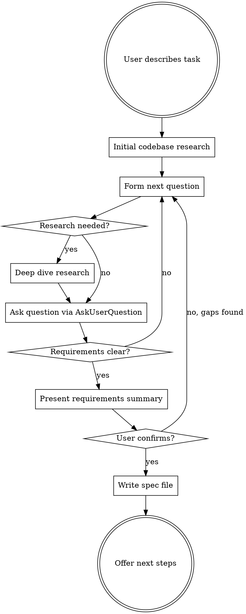

# Interview

## Overview

Thoroughly investigate what is actually intended before touching code. Research the codebase and external sources, then interrogate the user until every detail is unambiguous. Produce a self-contained requirements spec with a Definition of Done checklist — each step backed by testable, LLM-invokable proofs. The resulting spec can be passed directly to `/goal` for autonomous implementation.

**Core principle:** Never assume. If you don't know, research it. If you can't research it, ask.

**Announce at start:** "I'm using the interview skill to understand the full requirements before we build anything."

## The Iron Rule

**Do NOT write code, create plans, or start implementation until the user has explicitly confirmed the requirements summary is complete and accurate.**

This is non-negotiable. Not for "simple" tasks. Not for "obvious" features. Not when you're "pretty sure" you understand.

## Process Flow



## Phase 1: Initial Research

Before asking the user anything, gather context autonomously:

1. **Scan relevant code** — Use Explore agent or Grep/Glob to find files, patterns, and architecture related to the task
2. **Check existing tests** — Understand what's already tested and how
3. **Look for prior art** — Has something similar been built in this codebase?
4. **Check docs/plans/** — Are there existing specs or plans related to this?

**Goal:** Form informed questions. Don't ask the user things you can find in the code.

## Phase 2: Structured Questioning

Ask questions **one at a time** via AskUserQuestion. Each question should be:

- **Specific** — not "what do you want?" but "should the retry logic use exponential backoff or fixed intervals?"
- **Informed** — reference what you found in research: "I see the existing auth uses JWT tokens. Should the new endpoint follow the same pattern?"
- **Unambiguous** — no jargon without definition, no pronouns with unclear antecedents
- **Multiple choice when possible** — with your recommendation marked

### Question Categories

Work through these as relevant (not all apply to every task):

- **Purpose** — What problem does this solve? Who is it for?
- **Inputs/Outputs** — What data goes in? What comes out? What format?
- **Behavior** — What should happen in the happy path? What about errors?
- **Edge cases** — Empty inputs? Concurrent access? Rate limits? Timeouts?
- **Constraints** — Performance requirements? Compatibility? Security?
- **Integration** — How does this connect to existing code? What contracts must it honor?
- **Scope boundaries** — What is explicitly NOT included?

### On-Demand Research

When a question reveals you need more context:

- **Codebase:** Dispatch an Explore agent to investigate specific patterns, dependencies, or implementations
- **External:** Use WebSearch/WebFetch to research algorithms, library APIs, standards, or best practices
- **Share findings:** Tell the user what you learned before asking follow-up questions

### Red Flags — You're Not Done Yet

Stop and ask more questions if:

- You're about to write "TBD" or "to be determined" in the spec
- You have competing interpretations of a requirement
- You don't know what the error behavior should be
- You're unsure about the scope boundary
- You haven't discussed how to verify correctness

## Phase 3: Requirements Summary

When you believe you understand everything, present a structured summary:

```markdown
## Requirements Summary

**Goal:** [One sentence]

**What it does:**
- [Concrete behavior 1]
- [Concrete behavior 2]

**What it does NOT do:**
- [Explicit exclusion 1]

**Inputs:** [Specific formats, sources]
**Outputs:** [Specific formats, destinations]

**Error handling:**
- [Scenario] -> [Expected behavior]

**Constraints:**
- [Performance/security/compatibility requirements]

**Is this complete and accurate?**
```

The user MUST explicitly confirm before you proceed. If they identify gaps, return to Phase 2.

## Phase 4: Create Locked DoD via dod-guard MCP

Instead of writing the spec file directly, call the `dod_create` MCP tool to create a **locked, anti-cheat DoD document**. This stores proof commands canonically in MCP storage — editing the rendered markdown cannot weaken verification.

**Call `dod_create` with this structure:**

```json
{
  "title": "[Feature Name]",
  "goal": "[One sentence goal from confirmed summary]",
  "cwd": "[Absolute path to project root / working directory for running commands]",
  "markdown_path": "[Absolute path to docs/plans/YYYY-MM-DD-<topic>.md]",
  "sections": {
    "decisions": "[Optional: locked decisions with user]",
    "current_state": "[Optional: verified current state]",
    "requirements": "[Full requirements from confirmed summary — markdown]",
    "research_notes": "[Key findings: file paths, patterns, API notes — markdown]",
    "open_questions": "[Deferred items — markdown]",
    "open_risks": "[Optional: identified risks — markdown]"
  },
  "steps": [
    {
      "title": "Clear, self-contained step description",
      "proofs": [
        {
          "command": "cargo test -- test_name",
          "predicate": {"type": "exit_code", "value": 0},
          "description": "exit 0, all tests pass"
        },
        {
          "command": "grep \"pattern\" src/file.rs",
          "predicate": {"type": "exit_code", "value": 0},
          "description": "pattern found in expected file"
        },
        {
          "command": "grep \"removed_thing\" src/file.rs",
          "predicate": {"type": "exit_code", "value": 1},
          "description": "exit 1 — grep found no matches (removed_thing is gone)"
        }
      ]
    }
  ]
}
```

**Predicate types for proofs:**

| Type | Value | Meaning |
|------|-------|---------|
| `exit_code` | `0` | Command must exit with code 0 (success) |
| `exit_code` | `1` | Command must exit with code 1 |
| `exit_code_not` | `0` | Command must NOT exit 0. **Avoid for "no matches" — use `exit_code: 1` instead** (exit_code_not passes on command-not-found errors) |
| `output_contains` | `"text"` | stdout must contain the given text |
| `output_matches` | `"regex"` | stdout must match the regex |
| `manual` | _(none)_ | Human-only verification, skipped by checker |

**Fallback:** If `dod_create` is unavailable (MCP not connected), fall back to writing the markdown directly using the Write tool and warn the user that anti-cheat locking is not active.

### Definition of Done Guidelines

#### Step Design

Each step must be:
- **Self-contained** — can be implemented and tested independently
- **Ordered** — dependencies flow top to bottom
- **Concrete** — "Add retry logic with exponential backoff (base 1s, max 30s, 5 attempts) to the API client" not "handle retries"

#### Proof Design

Each proof must be:
- **LLM-invokable** — a command the AI can run directly (shell command, test runner, grep, curl, file read + pattern match, etc.)
- **Falsifiable** — has a clear pass/fail answer; no ambiguity
- **Expected value is exact** — specify the exact output, exit code, pattern, or measurable condition
- **Outcome-verifying, not process-verifying** — prove the thing works, not that a file was created

Good proofs:
```
- [ ] Proof: `cargo test -- test_auth_login` → exit code 0, all tests pass
- [ ] Proof: `curl -s localhost:3000/api/health` → response body contains `{"status":"ok"}`
- [ ] Proof: `grep "fn validate_email" src/auth.rs` → function exists with `#[cfg(test)]` module containing at least 3 test cases
- [ ] Proof: run `cargo build` → exit code 0, no warnings about unused imports in src/auth.rs
```

Bad proofs (vague, not invokable, not falsifiable):
```
- [ ] Proof: "code is clean" → expected: "it looks good"
- [ ] Proof: "feature works" → expected: "no bugs"
- [ ] Proof: "lines of code reduced" → expected: "significantly smaller"
```

#### The `dod_amend` Escape Hatch (Critical)

Some proofs will turn out to be unreasonable when the code is actually written. This is normal — requirements discovered during implementation can contradict initial assumptions. **Do not get stuck** trying to satisfy an impossible proof.

When a proof cannot be met, call `dod_amend` to modify the canonical proof:
```json
{
  "dod_id": "<id>",
  "step_index": 2,
  "proof_index": 0,
  "new_command": "wc -l src/parser.rs",
  "new_predicate": {"type": "exit_code", "value": 0},
  "new_description": "parser.rs exists and is under 200 lines",
  "reason": "Original 80-line target unreasonable — parser needs full error recovery. All functions ≤15 lines."
}
```

Rules for amendments:
- Only amend when the proof is genuinely unreasonable, not when you don't feel like satisfying it
- The replacement must be a concrete, machine-checkable claim — not a weakened version of the original
- **Cannot convert a machine-checkable proof to manual** — this is blocked by dod-guard to prevent instant-pass loopholes
- All amendments are permanently logged with reason in the DoD's audit trail
- `dod_check` runs the amended proof going forward

#### Proof Categories

Use these categories to ensure coverage:

| Category | What it verifies | Example proof |
|----------|-----------------|---------------|
| **Build** | Compiles without errors/warnings | `cargo build` → exit 0, no warnings |
| **Test** | Tests pass | `cargo test -- <test_name>` → exit 0 |
| **Lint/Format** | Code quality checks pass | `cargo clippy` → no new warnings |
| **Behavior** | Correct runtime behavior | `curl -X POST ...` → response contains `{"id":...}` |
| **Structure** | Code is in right place/pattern | `grep "impl Trait" src/` → trait impl found in expected file |
| **Absence** | Something is NOT present | `grep "TODO" src/new_module/` → exit 1 (no matches) |
| **Contract** | Interface/schema matches spec | `grep "pub fn" src/api.rs` → signature matches `fn create_user(name: &str, email: &str) -> Result<User>` |
| **Integration** | Works with existing system | `cargo test -- integration` → all integration tests pass |

## Phase 5: Output /goal Prompt

After creating the locked DoD, always output the `/goal` prompt directly — do NOT offer a choice menu. The user always wants a fresh-context /goal launch after DoD creation.

Output this exact block:

```
DoD created and locked. ID: <dod_id>. Saved to docs/plans/<filename>. <N> steps, <M> proofs.

Goal prompt for fresh context:

/goal Implement all <N> steps in the DoD (ID: <dod_id>). Work through each step sequentially. After completing each step, call dod_check to verify. The goal is met when dod_check returns overall PASS. If a proof is unreasonable, use dod_amend with a reason. The DoD markdown is at docs/plans/<filename> for reference.
```

That's it. No AskUserQuestion. No choice menu. Just the goal prompt.

## Anti-Rationalization Rules

| Thought | Reality |
|---------|---------|
| "This is obvious, skip to implementation" | Obvious tasks have the most hidden assumptions. Interview anyway. |
| "I'll figure it out as I code" | That's exactly how half-baked solutions happen. |
| "The user will tell me if I'm wrong" | Users shouldn't have to catch your wrong assumptions after the fact. |
| "Just one more question seems annoying" | One more question now saves an hour of rework later. |
| "I've asked enough questions" | Have you covered all the question categories? Have you presented the summary? Has the user confirmed? |
| "I can infer this from the codebase" | Inferences are assumptions. Verify with the user. |
| "This is a small change" | Small changes with wrong assumptions create bugs. |

## Common Mistakes

- **Asking generic questions** — "What do you want?" is useless. Research first, then ask specific questions.
- **Asking multiple questions at once** — One question per message. Always.
- **Skipping research** — Don't ask the user what's already in the code.
- **Premature summarizing** — Don't present the summary until you've genuinely explored all relevant categories.
- **Vague DoD steps** — "Implement the feature" is not a step. Each step needs concrete, LLM-invokable proofs with exact expected outcomes.
