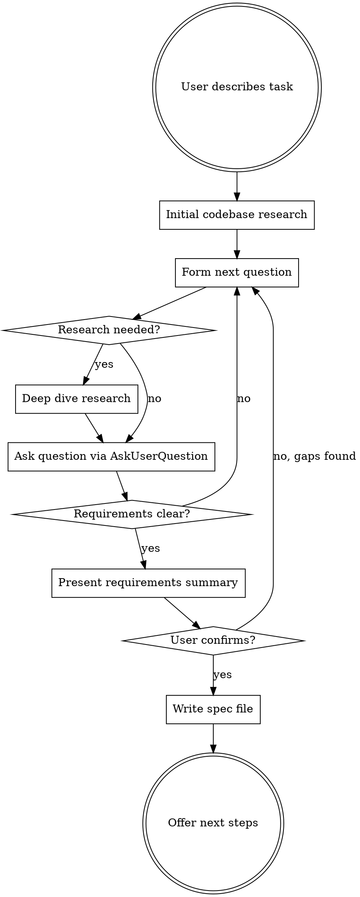

# Interview

## Overview

Thoroughly investigate what is actually intended before touching code. Research the codebase and external sources, then interrogate the user until every detail is unambiguous. Produce a self-contained requirements spec with a Definition of Done checklist — each step backed by testable, LLM-invokable proofs. The resulting spec can be passed directly to `/goal` for autonomous implementation.

**Core principle:** Never assume. If you don't know, research it. If you can't research it, ask.

**Announce at start:** "I'm using the interview skill to understand the full requirements before we build anything."

## The Iron Rule

**Do NOT write code, create plans, or start implementation until the user has explicitly confirmed the requirements summary is complete and accurate.**

This is non-negotiable. Not for "simple" tasks. Not for "obvious" features. Not when you're "pretty sure" you understand.

## Process Flow



## Phase 1: Initial Research

Before asking the user anything, gather context autonomously:

1. **Scan relevant code** — Use Explore agent or Grep/Glob to find files, patterns, and architecture related to the task
2. **Check existing tests** — Understand what's already tested and how
3. **Look for prior art** — Has something similar been built in this codebase?
4. **Check docs/plans/** — Are there existing specs or plans related to this?

**Goal:** Form informed questions. Don't ask the user things you can find in the code.

## Phase 2: Structured Questioning

Ask questions **one at a time** via AskUserQuestion. Each question should be:

- **Specific** — not "what do you want?" but "should the retry logic use exponential backoff or fixed intervals?"
- **Informed** — reference what you found in research: "I see the existing auth uses JWT tokens. Should the new endpoint follow the same pattern?"
- **Unambiguous** — no jargon without definition, no pronouns with unclear antecedents
- **Multiple choice when possible** — with your recommendation marked

### Question Categories

Work through these as relevant (not all apply to every task):

- **Purpose** — What problem does this solve? Who is it for?
- **Inputs/Outputs** — What data goes in? What comes out? What format?
- **Behavior** — What should happen in the happy path? What about errors?
- **Edge cases** — Empty inputs? Concurrent access? Rate limits? Timeouts?
- **Constraints** — Performance requirements? Compatibility? Security?
- **Integration** — How does this connect to existing code? What contracts must it honor?
- **Scope boundaries** — What is explicitly NOT included?

### On-Demand Research

When a question reveals you need more context:

- **Codebase:** Dispatch an Explore agent to investigate specific patterns, dependencies, or implementations
- **External:** Use WebSearch/WebFetch to research algorithms, library APIs, standards, or best practices
- **Share findings:** Tell the user what you learned before asking follow-up questions

### Red Flags — You're Not Done Yet

Stop and ask more questions if:

- You're about to write "TBD" or "to be determined" in the spec
- You have competing interpretations of a requirement
- You don't know what the error behavior should be
- You're unsure about the scope boundary
- You haven't discussed how to verify correctness

## Phase 3: Requirements Summary

When you believe you understand everything, present a structured summary:

```markdown
## Requirements Summary

**Goal:** [One sentence]

**What it does:**
- [Concrete behavior 1]
- [Concrete behavior 2]

**What it does NOT do:**
- [Explicit exclusion 1]

**Inputs:** [Specific formats, sources]
**Outputs:** [Specific formats, destinations]

**Error handling:**
- [Scenario] -> [Expected behavior]

**Constraints:**
- [Performance/security/compatibility requirements]

**Is this complete and accurate?**
```

The user MUST explicitly confirm before you proceed. If they identify gaps, return to Phase 2.

## Phase 3.5: Apply Company DoD Baselines

Before constructing the DoD steps, determine the work type and apply the company baseline from `standards/dod-baselines.md`.

### Determine Work Type

| If the task is… | Work type | Baseline |
|-----------------|-----------|----------|
| A bug fix, defect, regression, incident | **Bug** | Bug Fix baseline |
| A feature, enhancement, refactor, new component | **General** | General (Algemeen) baseline |

### Assess Project Cleanliness (Phase 1 output)

Before choosing proof commands, check the project's current lint/format state:

1. Run the language-appropriate linter on the full project — count existing violations. Record as `LINT_BASELINE`.
2. Run the formatter in **dry-run/check mode** — count files that would be changed. Record as `FORMAT_BASELINE`.
3. **If mostly clean (<10 violations)**: proactively fix remaining issues and use zero-tolerance greenfield proofs. Small cleanup is worth it.
4. **If dirty (10+ violations)**: use delta proofs:
   - **Lint**: scope to changed files, or assert warning count `<= LINT_BASELINE`
   - **Format**: dry-run only, assert violation count `<= FORMAT_BASELINE`. Never auto-format in brownfield — even single-file formatting can dominate a PR diff and make review impossible.

Record both baselines in `research_notes` so proofs can reference them.

See `standards/language-commands.md` for greenfield vs brownfield commands per language.

### Mandatory Minimum Proofs

**For Bug Fixes, the DoD must include at minimum:**

1. **Lint/quality** — lint proof scoped to changed files (or baseline count comparison if project has existing debt)
2. **Format/standards** — dry-run formatter, assert violation count `<= FORMAT_BASELINE` (never auto-format)
3. **Regression test (TDD)** — a `tdd: 0` proof ensuring a test for this specific bug was written red-first
4. **Regression test structure** — an `output_matches` proof verifying the test has real assertions about the bug condition
5. **Full test suite** — an `exit_code: 0` proof running the complete test suite (no regressions)
6. **Integration** — two-layer integration proof: (1) structural wiring — grep that the fix is connected to the system, (2) behavioral — exercise it through the system's real entry point. See Integration Proof Design below. This is the **last machine-checkable step** — it gates the transition to manual proofs.
7. **Application walkthrough** — a `manual` proof: run the app, verify the fix works and existing features aren't broken
8. **Code review** — a `manual` proof for peer review

**For General work, the DoD must include at minimum:**

1. **Lint/quality** — lint proof scoped to changed files (or baseline count comparison if project has existing debt)
2. **Format/standards** — dry-run formatter, assert violation count `<= FORMAT_BASELINE` (never auto-format)
3. **New unit tests (TDD)** — a `tdd: 0` proof for tests covering new functionality
4. **New test structure** — an `output_matches` proof verifying tests have meaningful assertions
5. **Full test suite** — an `exit_code: 0` proof running the complete test suite
6. **Documentation** — a structural proof (`exit_code: 0` via grep/find) that documentation exists for new components
7. **Integration** — a machine-checkable proof that exercises the feature through its real entry point (see Integration Proof Design below). This is the **last machine-checkable step** — it gates the transition to manual proofs.
8. **Application walkthrough** — a `manual` proof: run the app, verify new functionality works and existing features aren't broken
9. **Code review** — a `manual` proof for peer review

### Enforcement

- Machine-checkable proofs (lint, tests, TDD, structure) **cannot** be replaced with manual proofs
- TDD proofs are **non-negotiable** — bug fixes need regression tests, features need unit tests
- **Mostly clean (<10 violations)**: proactively fix remaining issues, use zero-tolerance proofs — worth the small cleanup
- **Dirty (10+ violations)**: lint scoped to changed files, format dry-run only with baseline comparison. Never auto-format in brownfield.
- **Integration proof is mandatory** — cannot be replaced with manual. Must exercise the feature's real entry point.
- Additional feature-specific proofs are added on top of these baselines
- If a baseline proof genuinely doesn't apply (e.g., no linter configured), note the omission in `open_risks` and discuss with the user

### Integration Proof Design

Integration proofs exist because **unit tests passing does not mean the feature works**. Claude consistently implements pieces correctly but fails to wire them together. The integration proof catches this by verifying the feature is **reachable from and working through the actual system** — not just that it works in isolation.

**The critical distinction:** A component that passes tests in a mock harness but is never imported into the real app is not integrated. An API handler that works in a test but is never registered in the router is not integrated. A CLI subcommand that works standalone but is never added to the parser is not integrated. Integration means the system knows about the new piece and a real user can reach it.

**Two-layer integration proof (both required):**

Every integration proof must verify two things:

1. **Wiring proof (structural)** — The new piece is connected to the system. Grep for the import, registration, route definition, menu entry, or config that makes the piece reachable. This is a `grep`/`find` with `output_matches` or `exit_code: 0`.

2. **Behavioral proof (runtime)** — The feature works when exercised through the system's actual entry point — not the component's own API, but the path a real user would take. This is a command that hits the running system or calls through the top-level interface.

Both layers are needed because:
- Wiring without behavior catches "registered but broken"
- Behavior without wiring catches "works in test harness but unreachable in production"

**Examples by project type:**

| Project type | Wiring proof (structural) | Behavioral proof (runtime) |
|--------------|---------------------------|----------------------------|
| UI (React/Vue/etc.) | `grep -r "NewComponent" src/pages/` or `grep "path.*new-route" src/router.*` — component imported and rendered in a real page/route | `curl -s localhost:3000/new-route` → `output_contains: "expected-element"` or test that renders the full page (not the component in isolation) and asserts the component appears |
| API/server | `grep "router\.\(get\|post\|put\).*new-endpoint" src/routes/` — route registered in the real router | `curl -s localhost:3000/api/new-endpoint` → `output_contains: "expected_field"` |
| CLI tool | `grep "add_subcommand\|command.*new-cmd" src/main.*` — subcommand registered in the parser | `./my-tool new-cmd --help` → `exit_code: 0` + `output_contains: "description"` |
| Library/SDK | `grep "pub use\|export.*NewThing" src/lib.*` — symbol exported from the public API | Test that `use mylib::NewThing` or `import { NewThing } from 'mylib'` compiles/runs → `exit_code: 0` |
| MCP server | `grep "name.*new_tool" src/index.*` — tool listed in the server's tool registration | Call the tool through the MCP protocol or test harness → `output_contains` |
| Plugin/extension | `grep "register\|activate.*NewPlugin" src/plugin-loader.*` — plugin registered in the host system | Test that exercises the host system and observes the plugin's effect → `output_contains` or `exit_code: 0` |
| Refactor | `grep` for the new function/module name at all former call sites — old callers updated | Existing integration/E2E tests still pass → `exit_code: 0` |
| Bug fix | `grep` for the fix at the actual code path (not just a test file) | Reproduce the original bug scenario end-to-end, verify it no longer occurs → `exit_code: 0` |

**Anti-patterns (rejected):**

- ❌ Component tested in React Testing Library / Storybook but never imported in a real page — that's a unit test with a fancy harness, not integration
- ❌ Handler tested directly via function call but never added to the router — works in isolation, unreachable in production
- ❌ Running unit tests and calling it "integration" — unit tests test units, not wiring
- ❌ `grep` for a function definition alone — proves the code exists, not that it's connected to the system
- ❌ A manual proof — integration must be machine-checkable
- ❌ Testing through mock/test infrastructure that bypasses the real system's wiring (mock servers, test harnesses that auto-discover components, in-memory routers)

**Step ordering rule:** The integration proof must be in the **final implementation step** of the DoD (the last step before any manual-only steps). This ensures all pieces are built before integration is verified, and prevents "done" claims when units pass but nothing is wired.

## Phase 4: Create Locked DoD via dod-guard MCP

Instead of writing the spec file directly, call the `dod_create` MCP tool to create a **locked, anti-cheat DoD document**. This stores proof commands canonically in MCP storage — editing the rendered markdown cannot weaken verification.

**XML-structured output:** The renderer wraps the agent guidance, each spec section, and the step list in semantic XML tags (`<claude_instructions>`, `<requirements>`, `<research_notes>`, `<definition_of_done>`, etc.) so the downstream `/goal` agent gets clean signal separation. Provide each section's content as **plain markdown** — the server adds the tags; do not wrap section content in XML yourself.

**Call `dod_create` with this structure:**

Every proof needs a `category` (company-baseline tag). `dod_create` **rejects** a DoD
missing the mandatory categories `integration_wiring`, `integration_behavioral`, and
`test`, and warns when `tdd` is absent or a step has only presence/structural proofs.
The DoD also needs a `type` (`bug` or `general`) to select the baseline.

```json
{
  "title": "[Feature Name]",
  "goal": "[One sentence goal from confirmed summary]",
  "type": "general",
  "cwd": "[Absolute path to project root / working directory for running commands]",
  "markdown_path": "[Absolute path to docs/plans/YYYY-MM-DD-<topic>.md]",
  "sections": {
    "decisions": "[Optional: locked decisions with user]",
    "current_state": "[Optional: verified current state]",
    "requirements": "[Full requirements from confirmed summary — markdown]",
    "research_notes": "[Key findings: file paths, patterns, API notes — markdown]",
    "open_questions": "[Deferred items — markdown]",
    "open_risks": "[Optional: identified risks — markdown]"
  },
  "steps": [
    {
      "title": "Clear, self-contained step description",
      "proofs": [
        {
          "command": "cargo test -- test_name",
          "predicate": {"type": "exit_code", "value": 0},
          "category": "test",
          "description": "exit 0, all tests pass"
        },
        {
          "command": "grep -w \"register_route\" src/app.rs",
          "predicate": {"type": "exit_code", "value": 0},
          "category": "integration_wiring",
          "description": "feature is wired into the real router (word-boundary match)"
        },
        {
          "command": "curl -fs localhost:8080/feature",
          "predicate": {"type": "exit_code", "value": 0},
          "category": "integration_behavioral",
          "description": "feature reachable through the running system's entry point"
        }
      ]
    }
  ]
}
```

**Proof categories:** `lint`, `format`, `tdd`, `structure`, `test`,
`integration_wiring`, `integration_behavioral`, `manual`, `other`. Mandatory (enforced
at create): `integration_wiring` + `integration_behavioral` + `test`. **Precision:**
presence/removal proofs must match signatures or word boundaries (`grep -w`, `findstr /R`),
never bare substrings — e.g. `TryStopTracking(dossierId)` vs `TryStopTracking(dossierId, clientId)`
will collide on a bare substring match.

**Predicate types for proofs:**

| Type | Value | Meaning |
|------|-------|---------|
| `exit_code` | `0` | Command must exit with code 0 (success) |
| `exit_code` | `1` | Command must exit with code 1 |
| `exit_code_not` | `0` | Command must NOT exit 0. **Avoid for "no matches" — use `exit_code: 1` instead** (exit_code_not passes on command-not-found errors) |
| `output_contains` | `"text"` | stdout must contain the given text |
| `output_matches` | `"regex"` | stdout must match the regex |
| `output_not_contains` | `"text"` | stdout must NOT contain text (e.g. "no warnings", "no TODO") |
| `output_not_matches` | `"regex"` | stdout must NOT match regex |
| `tdd` | `0` | **TDD enforcer.** Must be observed FAILING before it can pass. Run `dod_check` after writing the failing test (RED), then implement (GREEN). Passes only when: seen_failing=true AND command exits with value. |
| `manual` | _(none)_ | Human-only verification, confirmed out-of-band (elicitation/dialog) — the model cannot self-pass it |
| `review` | _(none)_ | Fresh-context code review. At check time the agent runs `/code-review` against the diff vs requirements and confirms PASS only if no correctness/requirement gaps remain. Verdict arrives via the same un-fakeable channel as `manual`; FAIL is never cached. Use for intent/edge-case correctness that command proofs can't assert. |

**When to use `tdd` predicates:**

Use `tdd` when a step involves writing new functionality that should be test-driven. The workflow:
1. Write the test (it should fail — the feature doesn't exist yet)
2. Run `dod_check` — the TDD proof records the failure (RED phase)
3. Implement the feature
4. Run `dod_check` again — test passes AND was previously seen failing → proof passes

If a test passes without ever being seen failing, dod-guard rejects it with "TDD VIOLATION" — this prevents writing tests after implementation that merely confirm existing behavior.

**Recommended TDD proof pattern — always pair structural + temporal:**

A `tdd` predicate alone proves red-to-green, but not that the test is meaningful. The agent could write a trivially failing test, then fix it. Always pair TDD proofs with a structural check that verifies the test has real assertions:

```json
{
  "title": "Add email validation with TDD",
  "proofs": [
    {
      "command": "grep -E \"assert.*(invalid|valid|@|email)\" tests/test_email.py",
      "predicate": {"type": "output_matches", "value": "assert.*(invalid|@)"},
      "description": "test file contains assertions about email validity"
    },
    {
      "command": "python -m pytest tests/test_email.py -v",
      "predicate": {"type": "tdd", "value": 0},
      "description": "TDD: tests must fail first (RED), then pass after implementation (GREEN)"
    }
  ]
}
```

The structural proof verifies the test checks something real (not `assert True`). The TDD proof verifies the red-to-green cycle. Together they enforce genuine test-driven development.

Flexible naming is fine — use regex patterns like `output_matches: "test_.*valid"` rather than exact test names, since the agent may choose reasonable names during implementation.

**When to use `output_not_contains` / `output_not_matches`:**

Use for absence checks that go beyond exit codes:
- Linter output with `output_not_contains: "warning"` — no lint warnings (scope to changed files in brownfield projects)
- `grep -r "TODO" src/new_module/` with `output_not_matches: "TODO.*HACK"` — no TODO+HACK combos in new code
- Build output with `output_not_contains: "deprecated"` — no deprecation warnings

**Important:** In brownfield projects with pre-existing violations, scope `output_not_contains` checks to changed files or new modules only. See `standards/language-commands.md` for delta techniques per language.

**Fallback:** If `dod_create` is unavailable (MCP not connected), fall back to writing the markdown directly using the Write tool and warn the user that anti-cheat locking is not active.

### Definition of Done Guidelines

#### Step Design

Each step must be:
- **Self-contained** — can be implemented and tested independently
- **Ordered** — dependencies flow top to bottom
- **Concrete** — "Add retry logic with exponential backoff (base 1s, max 30s, 5 attempts) to the API client" not "handle retries"

#### Proof Design

Each proof must be:
- **LLM-invokable** — a command the AI can run directly (shell command, test runner, grep, curl, file read + pattern match, etc.)
- **Falsifiable** — has a clear pass/fail answer; no ambiguity
- **Expected value is exact** — specify the exact output, exit code, pattern, or measurable condition
- **Outcome-verifying, not process-verifying** — prove the thing works, not that a file was created

Good proofs (language-agnostic patterns):
```
- [ ] Proof: `<test-runner> <test-filter>` → exit code 0, targeted tests pass
- [ ] Proof: `curl -s localhost:3000/api/health` → response body contains `{"status":"ok"}`
- [ ] Proof: `grep "validate_email" src/auth.*` → function exists in expected location
- [ ] Proof: `<linter> $(git diff --name-only HEAD~1)` → exit 0, no new lint violations in changed files
```

Bad proofs (vague, not invokable, not falsifiable):
```
- [ ] Proof: "code is clean" → expected: "it looks good"
- [ ] Proof: "feature works" → expected: "no bugs"
- [ ] Proof: "lines of code reduced" → expected: "significantly smaller"
```

#### The `dod_amend` Escape Hatch (Critical)

Some proofs will turn out to be unreasonable when the code is actually written. This is normal — requirements discovered during implementation can contradict initial assumptions. **Do not get stuck** trying to satisfy an impossible proof.

When a proof cannot be met, call `dod_amend` to modify the canonical proof:
```json
{
  "dod_id": "<id>",
  "step_index": 2,
  "proof_index": 0,
  "new_command": "wc -l src/parser.rs",
  "new_predicate": {"type": "exit_code", "value": 0},
  "new_description": "parser.rs exists and is under 200 lines",
  "reason": "Original 80-line target unreasonable — parser needs full error recovery. All functions ≤15 lines."
}
```

Rules for amendments:
- Only amend when the proof is genuinely unreasonable, not when you don't feel like satisfying it
- The replacement must be a concrete, machine-checkable claim — not a weakened version of the original
- **Cannot convert a machine-checkable proof to manual** — this is blocked by dod-guard to prevent instant-pass loopholes
- All amendments are permanently logged with reason in the DoD's audit trail
- `dod_check` runs the amended proof going forward

#### Proof Categories

Use these categories to ensure coverage. Mandatory categories are marked below per company DoD baselines (see Phase 3.5). For concrete commands per language, see `standards/language-commands.md`.

| Category | What it verifies | Example approach | Predicate | Required? |
|----------|-----------------|-----------------|-----------|-----------|
| **Lint** (mandatory) | Code quality / SonarQube clean | Run linter on changed files | `output_not_contains` or `exit_code: 0` | Always (delta-scoped in brownfield) |
| **Format** (mandatory) | Code standards / formatting | Dry-run formatter, count violations, assert `<= FORMAT_BASELINE` | `exit_code: 0` | Always (never auto-format) |
| **Test** (mandatory) | Full test suite passes | Run full test suite | `exit_code: 0` | Always |
| **TDD** (mandatory) | Test written before implementation | Run specific new test | `tdd: 0` (must fail first) | Always (regression for bugs, unit for general) |
| **Structure** (mandatory) | Test has real assertions | grep for assertion patterns | `output_matches` | Always (paired with TDD) |
| **Code Review** (mandatory) | Reviewed by another developer | — | `manual` | Always |
| **Documentation** (mandatory) | New components documented | find/grep for docs | `exit_code: 0` | General only |
| **Build** | Compiles without errors | Build command | `exit_code: 0` | Recommended |
| **Behavior** | Correct runtime behavior | curl/HTTP check | `output_contains` | Feature-specific |
| **Absence** | Something is NOT present | grep for removed pattern | `exit_code: 1` | Feature-specific |
| **Pattern absence** | Specific pattern not in output | grep for anti-pattern in new code | `output_not_matches` | Feature-specific |
| **Contract** | Interface/schema matches spec | grep for function/type signature | `output_matches` | Feature-specific |
| **Integration** (mandatory) | Feature wired into system AND works through real entry point | Two proofs: (1) grep for wiring (import/registration/route), (2) behavioral test through system entry point | `exit_code: 0` or `output_contains` | **Always** (last machine-checkable step) |
| **Regression** | Bug doesn't recur | Run bug-specific test | `tdd: 0` (proves test was red) | Bug fixes (via TDD) |

## Phase 4.5: Baseline Check

Immediately after `dod_create` succeeds, run `dod_check` once — **before** any implementation. This is a baseline, and it validates two things:

1. **All proofs are RED** — overall **FAIL** is expected and correct here; the feature does not exist yet. TDD proofs in particular MUST be red now (that records the required red phase).
2. **Every proof command actually runs** — a `command not found` / OS error at baseline means the proof is mis-authored (wrong shell, wrong tool for this OS). Fix it via `dod_amend` now, while it's cheap — not mid-implementation after a 26-amend pileup.

Interpreting the baseline:
- Proofs failing because the code isn't written yet → good, proceed.
- Proofs failing because the **command errored** (not found, bad path, tamper) → fix before handing off.
- A proof that PASSES at baseline (before any code) is suspect — it likely doesn't test the new behavior. Strengthen it.

## Phase 5: Output /goal Prompt

After the baseline check, always output the `/goal` prompt directly — do NOT offer a choice menu. The user always wants a fresh-context /goal launch after DoD creation.

Output this exact block:

```
DoD created and locked. ID: <dod_id>. Saved to docs/plans/<filename>. <N> steps, <M> proofs.

Goal prompt for fresh context:

/goal
<task>Implement all <N> steps in the DoD (ID: <dod_id>).</task>
<reference>DoD markdown: docs/plans/<filename> — sections and steps are wrapped in semantic XML tags for precise parsing.</reference>
<process>
Work through each step sequentially. After completing a step, call dod_check with `step: N` to verify just that step (fast — other steps are carried, not re-run). If a proof is unreasonable, call dod_amend with a reason instead of forcing it. When all steps are done, call dod_check with no `step` for the full PASS verdict.
</process>
<success_criteria>A full dod_check (no `step`) returns overall PASS for every machine-checkable proof. Scoped (`step: N`) runs return INCOMPLETE and never satisfy completion.</success_criteria>
<on_completion>List every remaining manual step the user must complete before this work is done.</on_completion>
```

Use real XML tags (not placeholders) so the fresh `/goal` agent gets clear signal separation between task, reference, process, and exit conditions. Do NOT add a `<reasoning>` or "think step by step" tag — it competes with the model's native reasoning.

The goal agent must end its work by listing all manual proofs that require human action:

```
## Manual steps remaining

All machine-checkable proofs pass. The following manual steps still need to happen:

- [ ] Code review: code reviewed by another developer, comments discussed
- [ ] Application walkthrough: manually verify the running application — check the changed functionality works and existing features aren't broken
- [ ] Release: deploy to correct environment
- [ ] Cleanup: remove test databases
- [ ] (any other manual proofs from the DoD)
```

This list must be printed even if the goal agent considers the work "done" — machine proofs passing is not the full DoD.

That's it. No AskUserQuestion. No choice menu. Just the goal prompt.

## Anti-Rationalization Rules

| Thought | Reality |
|---------|---------|
| "This is obvious, skip to implementation" | Obvious tasks have the most hidden assumptions. Interview anyway. |
| "I'll figure it out as I code" | That's exactly how half-baked solutions happen. |
| "The user will tell me if I'm wrong" | Users shouldn't have to catch your wrong assumptions after the fact. |
| "Just one more question seems annoying" | One more question now saves an hour of rework later. |
| "I've asked enough questions" | Have you covered all the question categories? Have you presented the summary? Has the user confirmed? |
| "I can infer this from the codebase" | Inferences are assumptions. Verify with the user. |
| "This is a small change" | Small changes with wrong assumptions create bugs. |

## Common Mistakes

- **Asking generic questions** — "What do you want?" is useless. Research first, then ask specific questions.
- **Asking multiple questions at once** — One question per message. Always.
- **Skipping research** — Don't ask the user what's already in the code.
- **Premature summarizing** — Don't present the summary until you've genuinely explored all relevant categories.
- **Vague DoD steps** — "Implement the feature" is not a step. Each step needs concrete, LLM-invokable proofs with exact expected outcomes.
